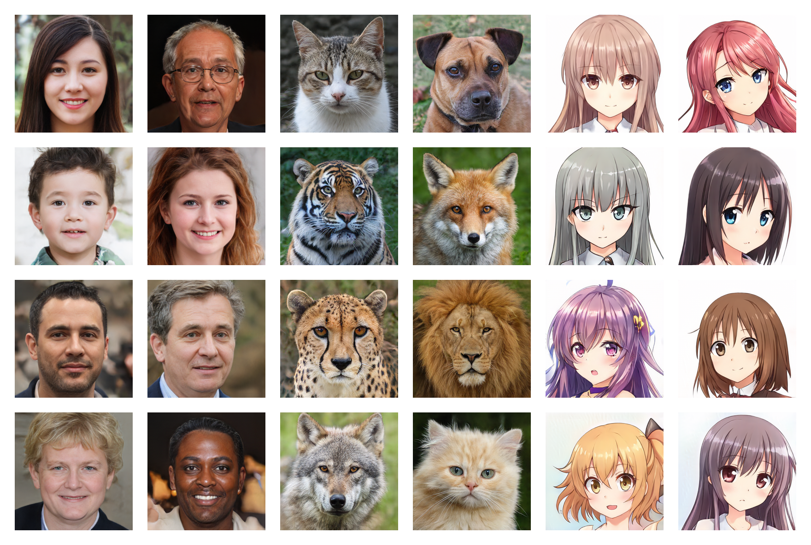
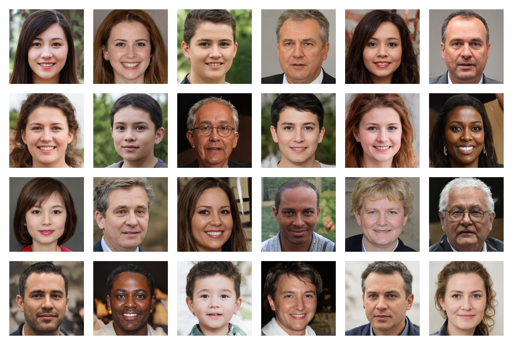
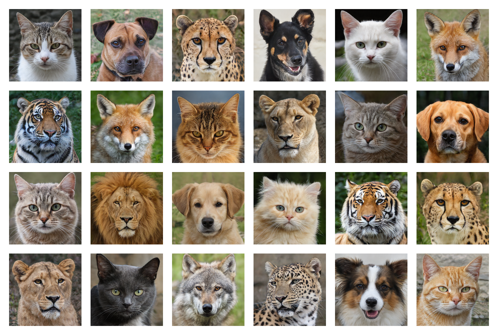
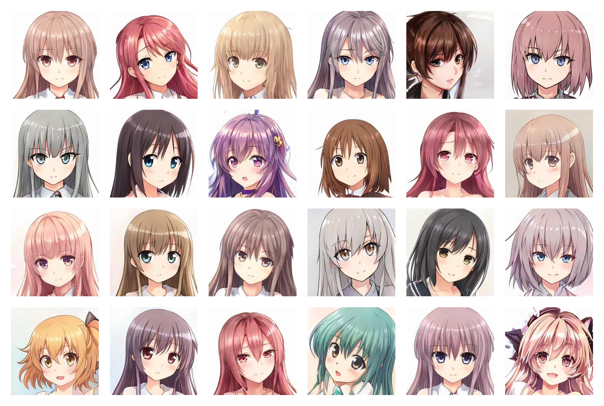

# Generative Adversarial Network (GAN)


<br/>

This project is a deep learning model that can create high quality images from a random seed:

<br/>

<p align="center">
	
</p>

<br/>

# Summary

* **[Summary](#summary)**
* **[Dependencies](#dependencies)**
* **[Training](#training)**
* **[Trained weights](#trained-weights)**
* **[Testing](#testing)**
* **[Model](#model)**
* **[Tests](#tests)**
* **[Credits](#credits)**

<br/>

# Dependencies

* [**Python**](https://www.python.org/)
* [**Pytorch**](https://pytorch.org/)
* [**Matplotlib**](https://matplotlib.org/)
* [**Pillow**](https://pillow.readthedocs.io/)
* [**Scipy**](https://www.scipy.org/)

<br/>

Run the following command to install the dependencies:
```shell
$ pip install -r requirements.txt
```
*(You may need to use a [**specific command**](https://pytorch.org/get-started/locally/) for Pytorch if you want to use CUDA)*

<br/>

# Training

* First, you need to find and download a dataset of images *(less than 5,000 may be too little and more than 150,000 is not necessary)*. You can find a lot of datasets on [**Kaggle**](https://www.kaggle.com/datasets)

* Then, in the `training/settings.py` file, specify the **path** to the dataset

* If you don't have an overpriced 24GB GPU like me, the default settings may not work for you. You can try to:
	* Lower the **batch size** *(less stable and worse lower point)*
	* Increase the **accumulation steps** *(fix previous problems but slower)*
	* Lower the **min features** *(worse results)*
	* Decrease the **image size**

* Run the `training.ipynb` file *(you can stop the training at any time and resume it later thanks to the checkpoints)*

<br/>

# Trained weights

The trained weights on multiple datasets are available on [**Google Drive**](https://drive.google.com/drive/folders/1m4Puqmb9OD8dcbgr7HStpT7QIFksJ8LR?usp=sharing), you just need to download the `.pt` files and put them in the `models` folder.

<br/>

# Testing

* Run the `testing.ipynb` file to generate random images

* Run the `testing/interpolation.ipynb` file to generate the images of a smooth interpolation video

* Run the `testing/projector.ipynb` file to project real images into the latent space

* Run the `testing/style_mixing.ipynb` file to generate the images of a style mixing interpolation video

* Run the `testing/timelapse.ipynb` file to generate the images of a training timelapse video

<br/>

# Model

The model is a Generative Adversarial Network (GAN) like described in the paper [**Generative Adversarial Nets**](https://doi.org/10.48550/arXiv.1406.2661) from **Montreal University** (2014)

The generator and the discriminator are both deep convolutional neural networks like in the paper [**Unsupervised Representation Learning with Deep Convolutional Generative Adversarial Networks**](https://doi.org/10.48550/arXiv.1511.06434) from **Facebook AI Research** (2015) but with a few improvements:

### For both networks:

* I added **Equalized Learning Rate Layers** from the paper [**Progressive Growing of GANs for Improved Quality, Stability, and Variation**](https://doi.org/10.48550/arXiv.1710.10196) by **Nvidia** (2017)

* I added **Bilinear Upsampling / Downsampling** from the paper [**Making Convolutional Networks Shift-Invariant Again**](https://doi.org/10.48550/arXiv.1904.11486) by **Adobe Research** (2019)

* I implemented **Wavelet Transform** from the paper [**SWAGAN: A Style-based Wavelet-driven Generative Model**](https://doi.org/10.48550/arXiv.2102.06108) by **Tel-Aviv University** (2021)

### For the generator:

* I used a **Style-Based Architecture** with a **Constant Input**, **Learned Styles** from a **Mapping Network** and **Noise Injection** from the paper [**A Style-Based Generator Architecture for Generative Adversarial Networks**](https://doi.org/10.48550/arXiv.1812.04948) by **Nvidia** (2018)

* I added **Skip Connections** from the paper [**MSG-GAN: Multi-Scale Gradients for Generative Adversarial Networks**](https://doi.org/10.48550/arXiv.1903.06048) by **TomTom** and **Adobe** (2019)

### For the discriminator:

* I added **Residual Blocks** from the paper [**Deep Residual Learning for Image Recognition**](https://doi.org/10.48550/arXiv.1512.03385) by **Microsoft Research** (2015)

* I added **Minibatch Standard Deviation** at the end of the discriminator from the paper [**Improved Techniques for Training GANs**](https://doi.org/10.48550/arXiv.1606.03498) by **OpenAI** (2016)

### For training:

* I kept the original **Non-Saturating Loss** from the paper [**Generative Adversarial Nets**](https://doi.org/10.48550/arXiv.1406.2661) by **Montreal University** (2014)

* I added **Path Length Regularization** on the generator from the paper [**Analyzing and Improving the Image Quality of StyleGAN**](https://doi.org/10.48550/arXiv.1912.04958) by **Nvidia** (2019)

* I added **Gradient Penalty Regularization** on the discriminator from the paper [**Improved Training of Wasserstein GANs**](https://doi.org/10.48550/arXiv.1704.00028) by **Google Brain** (2017)

* I'm currently working on adding **Adaptive Discriminator Augmentation (ADA)** from the paper [**Training Generative Adversarial Networks with Limited Data**](https://doi.org/10.48550/arXiv.2006.06676) by **Nvidia** (2020) but the augmentation probability will not be trained and will have to be set manually...

### For testing:

* I'm currently working on a **Projector** like in the paper [**Analyzing and Improving the Image Quality of StyleGAN**](https://doi.org/10.48550/arXiv.1912.04958) by **Nvidia** (2019)...

<br/>

# Tests

<p align="center"><b>Human faces (256*256)</b></p>
<p align="center">
	
</p>

<br/>

<p align="center"><b>Animal faces (256*256)</b></p>
<p align="center">
	
</p>

<br/>

<p align="center"><b>Anime faces (256*256)</b></p>
<p align="center">
	
</p>

<br/>

# Credits

* [**Angel Uriot**](https://github.com/angeluriot) : Creator of the project.
